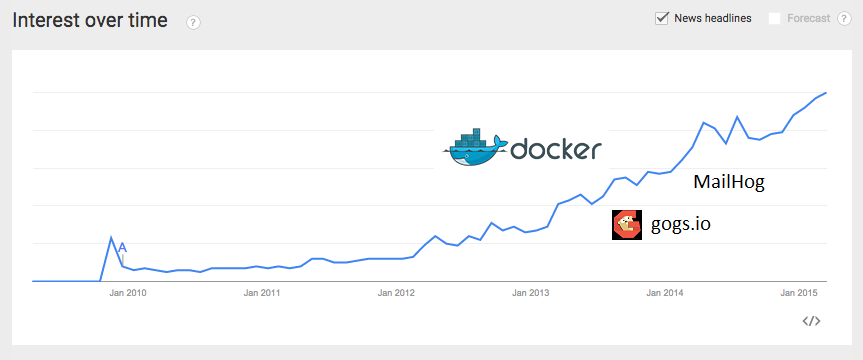

# Introduction

## Les origines

GO a été développé par Google en 2007

* Robert Griesemer  :  V8 JS engine, GFS distributed FS
* Rob Pike          :  Plan 9, UTF8
* Kenneth Thompson  :  Unix, langages B et C

## Evolution

## En bref

_GO is an open source, compiled, garbage-collected,
concurrent system programming language_

+-----------------------+----------------------------+
| ++                    | --                         |
+=======================+============================+
| - simple, rapide      | - outillage (IDE, GDB)     |
| - concurrent          | - majuscule = _public_     |
| - librairie standard  | - packages / dépendances   |
+-----------------------+----------------------------+

