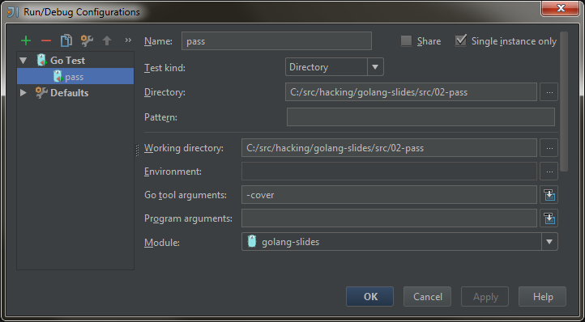

# Installation

## Il vous faut

* [Go](https://golang.org/dl/) 1.5.1
* [IntelliJ IDEA](https://www.jetbrains.com/idea/download/) 14.1.5
* [go-lang-idea-plugin](https://github.com/go-lang-plugin-org/go-lang-idea-plugin) #485

Slides: [http://hackingmondays.github.io/golang-slides/](http://hackingmondays.github.io/golang-slides/)

~~~
golang-slides [https://github.com/HackingMondays/golang-slides]
  +---src
  |   +---00-pingpong
  |   +---01-fail
  |   +---02-pass
      ...
  golang-slides.html
~~~

## Configuration

### Windows

~~~ {.sh}
REM # ni espaces, ni accents dans les chemins !
set GOROOT=C:\Go
set GOPATH=C:\src\gopath;C:\src\hacking\golang-slides
set PATH=%PATH%;%GOROOT%\bin;C:\src\gopath\bin
~~~

### Mac / Unix

~~~ {.sh}
export GOROOT=/usr/local/go
export GOPATH=$HOME/src/gopath:$HOME/src/hacking/golang-slides
export PATH=$PATH:$GOROOT/bin:$HOME/src/gopath/bin

# MacOS only
launchctl setenv GOROOT $GOROOT
launchctl setenv GOPATH $GOPATH
~~~

## GOPATH

~~~
$~/src/gopath
.
├── bin
│   └── gocode
├── pkg
│   └── darwin_amd64
└── src
    ├── code.google.com
    ├── github.com
    ├── golang.org
    └── gopkg.in
        ├── check.v1
        └── qml.v1
            ├── README.md
            ├── qml.go
                ...
~~~

## Check Console

~~~ {.sh}
go version

go env

cd src/00-pingpong
go run pingpong.go
go build -o pipo
./pipo

# download and install into $GOPATH (requires mercurial)
go get golang.org/x/tools/cmd/vet
go get golang.org/x/tools/cmd/godoc
godoc -http=:6060 &
~~~

documentation : [http://localhost:6060/](http://localhost:6060/)

## Plugin IDEA

Installation à partir du disque :

~~~
File, Settings, Plugins, Install plugin from disk...
    => Go.485.zip
~~~

Ou à partir du repo :

~~~
File, Settings, Plugins, Browse repositories...
    Manage repositories
        [+]
            https://plugins.jetbrains.com/plugins/alpha/5047
        OK
        Repository: All => https://plugins.jetbrains.com/plugins/...
            GO
                Install Plugin, Yes, Restart
~~~

## Check IDEA

~~~
Run, Edit Configurations, [+], Go Test
~~~

