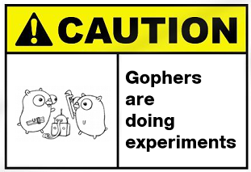

# Conclusion

## Recapitulatif

* concurrence avec `go` et `chan`
* package `testing`
* slices, `for`, `range`
* `regex`, `encoding/json`
* `type`, `struct`, `interface`
* `net/http`, `io`
* `flag`
* `os`, `bufio`

## Go 1.5

Sortie en août 2015

* Go écrit entièrement en Go
* Garbage collector concurrent
* Support Android et iOS ([experimental](https://github.com/golang/mobile))

## Quelques liens

* [State of GO (May 2015)](http://talks.golang.org/2015/state-of-go-may.slide#1)
* [Why Go Is Not Good](http://yager.io/programming/go.html)
* [Go Projects](https://github.com/golang/go/wiki/Projects)
* [Go Search](http://go-search.org/)
* [Go Package management](http://nathany.com/go-packages/)
* [Get your development team started with Go](https://www.digitalocean.com/company/blog/get-your-development-team-started-with-go/)
* [Resources for new Go programmers](http://dave.cheney.net/resources-for-new-go-programmers)

# Merci

## A bientot

